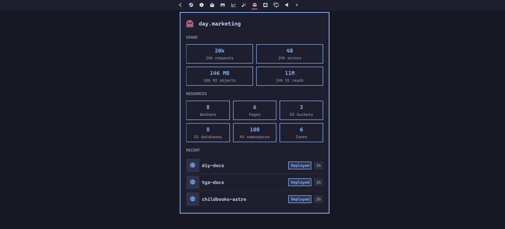

# Omarchy Cloudflare Plugin



Bar widget for Cloudflare account resources, usage meters, recent deploys, and quick links into the dashboard.

## Install

```bash
omarchy plugin add https://github.com/sebday/omarchy-cloudflare.git
omarchy plugin enable evo.cloudflare
```

## Requirements

- `curl` and `bash` on `PATH`
- `pass` for API token storage (optional if you only use the bar after manual setup)

## Auth

The bar loads a Cloudflare API token from:

```bash
pass insert omarchy/cloudflare/read-all
```

Use a token with read access to Workers, Pages, R2, D1, Queues, KV, and Zones. Cache purge actions need the Cache Purge permission on the relevant zone.

## Settings

Widget options live on the bar layout entry in `~/.config/omarchy/shell.json`:

```json
{
  "id": "evo.cloudflare",
  "refreshIntervalSec": 60,
  "analyticsIntervalSec": 900,
  "deployRows": 8,
  "overviewDeployRows": 3,
  "errorRatePercent": 1,
  "workerRequestsPerDay": 0,
  "r2StorageGb": 0,
  "d1RowsReadPerDay": 0,
  "projectsRoot": ""
}
```

Set usage limits above zero to show Workers requests, R2 storage, and D1 rows read as meters. `projectsRoot` overrides the default scan of `~/projects` and `~/work` for local Wrangler project paths.

## IPC

```bash
omarchy-shell shell toggle evo.cloudflare '{}'
omarchy-shell evo.cloudflare refresh
```

